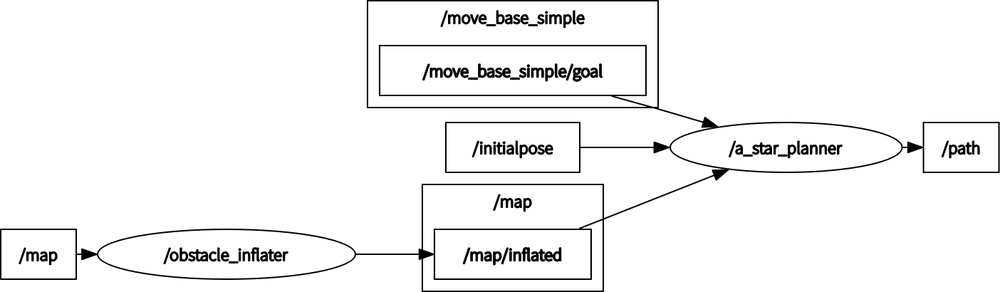

# a_star_ros


[](https://opensource.org/licenses/MIT)

ROS implementation of A* search algorithm

<p align="center">
  
</p>

## Environment
- Ubuntu 20.04
- ROS Noetic

## Install and Build
```
# clone repository
cd /path/to/your/catkin_ws/src
git clone https://github.com/ToshikiNakamura0412/a_star_ros.git

# build
cd /path/to/your/catkin_ws
rosdep install -riy --from-paths src --rosdistro noetic # Install dependencies
catkin build a_star_ros -DCMAKE_BUILD_TYPE=Release      # Release build is recommended
```

## How to use
```
roslaunch a_star_ros a_star.launch
```

## Running the demo
### Basic 
```
roslaunch a_star_ros test.launch
```
<p align="center">
  
</p>

### Basic with debug
```
roslaunch a_star_ros test.launch debug_mode:=true
```
<p align="center">
  
</p>

### Planning for local map
```
# clone repository
cd /path/to/your/catkin_ws/src
git clone https://github.com/ToshikiNakamura0412/raycast_mapping_ros.git
git clone https://github.com/ToshikiNakamura0412/scan_to_pcl_ros.git
git clone -b noetic-devel https://github.com/ROBOTIS-GIT/turtlebot3_msgs.git
git clone -b noetic-devel https://github.com/ROBOTIS-GIT/turtlebot3.git
git clone -b noetic-devel https://github.com/ROBOTIS-GIT/turtlebot3_simulations.git

# build
cd /path/to/your/catkin_ws
rosdep install -riy --from-paths src --rosdistro noetic
catkin build -DCMAKE_BUILD_TYPE=Release

# run demo
export TURTLEBOT3_MODEL=burger
roslaunch a_star_ros test.launch use_local_map:=true
```
<p align="center">
  
</p>


## Node I/O


## Nodes
### a_star_planner
#### Published Topics
- ~\<name>/path (`nav_msgs/Path`)
  - planned path

#### Subscribed Topics
- /initialpose (`geometry_msgs/PoseWithCovarianceStamped`)
  - start pose
- /map (`nav_msgs/OccupancyGrid`)
  - costmap
  - the cells with an occupancy probability of 100 are considered as obstacles
- /move_base_simple/goal (`geometry_msgs/PoseStamped`)
  - goal pose

#### Parameters
- ~\<name>/<b>hz</b> (int, default: `2` [Hz]):<br>
  - The rate of main loop
- ~\<name>/<b>weight_of_heuristic</b> (float, default: `1.0`):<br>
  - The weight of heuristic
- ~\<name>/<b>debug_mode</b> (bool, default: `false`):<br>
  - If this mode is used, you should set this parameter to true.
  - if this mode is used, following topics is published.
    - ~\<name>/current_node (`geometry_msgs::PointStamped`)
    - ~\<name>/open_set (`geometry_msgs::PoseArray`)
    - ~\<name>/close_set (`geometry_msgs::PoseArray`)
    - ~\<name>/neighbor_nodes (`geometry_msgs::PoseArray`)
- ~\<name>/<b>sleep_time</b> (float, default: `0.01` [s]):<br>
  - The sleep time when debug mode

### obstacle_inflater
#### Published Topics
- /map/inflated (`nav_msgs/OccupancyGrid`)
  - costmap
  - the cells with an occupancy probability of 100 are considered as obstacles

#### Subscribed Topics
- /map (`nav_msgs/OccupancyGrid`)
  - costmap
  - the cells with an occupancy probability of 100 are considered as obstacles

#### Parameters
- ~\<name>/<b>hz</b> (int, default: `1` [Hz]):<br>
  - The rate of main loop
- ~\<name>/<b>inflation_radius</b> (float, default: `0.15` [m]):<br>
  - The robot radius

## References
- https://myenigma.hatenablog.com/entry/20140503/1399080847
